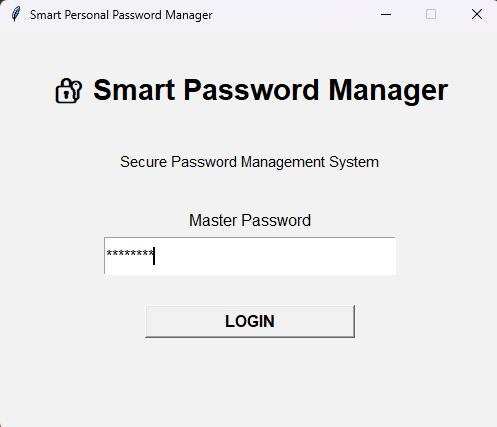
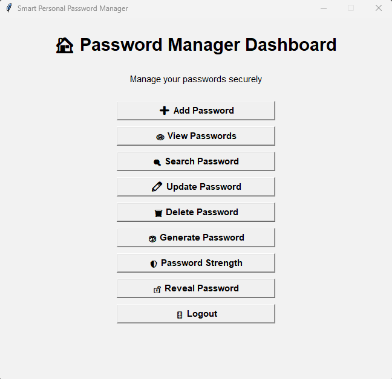
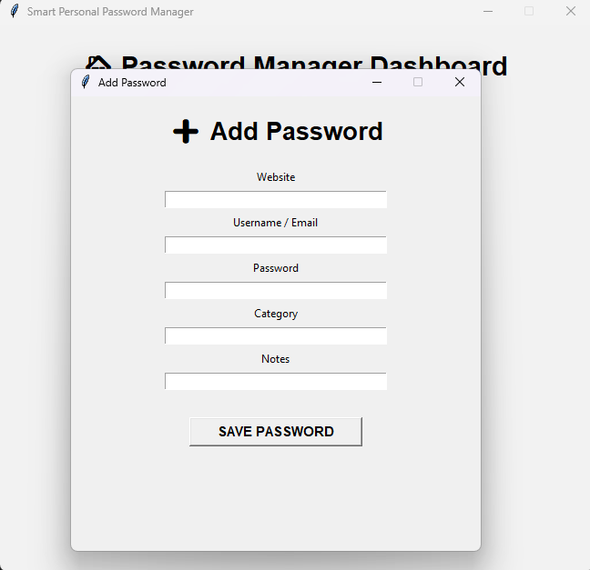
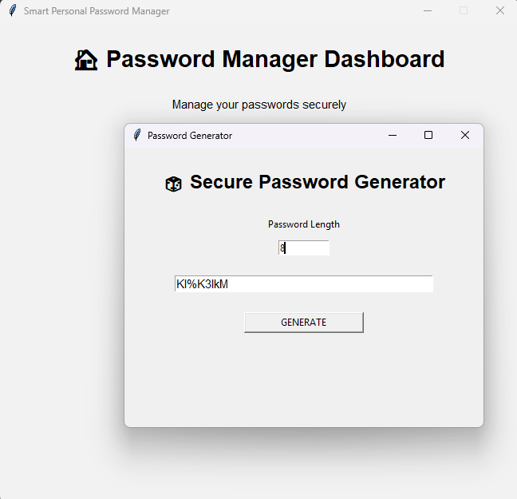

# 🔐 Smart Personal Password Manager

A secure desktop password manager developed using Python.

## 🚀 Features

- Master password authentication
- bcrypt password hashing
- PBKDF2-HMAC-SHA256 key derivation
- Fernet password encryption
- SQLite database
- Secure password generator
- Password strength checker
- Add / View / Search / Update / Delete passwords
- Masked password display
- Password reveal functionality
- Tkinter graphical user interface
- Logout functionality
- Input validation and error handling

## 🛠️ Technologies

- Python
- Tkinter
- SQLite
- bcrypt
- Cryptography
- PBKDF2
- Fernet

## Screenshots

### Login Screen


### Dashboard


### Add Password


### Password Generator


## ▶️ How to Run

```bash
pip install -r requirements.txt
python gui.py
